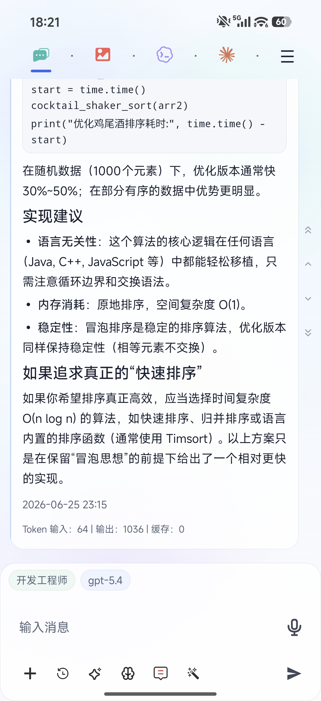
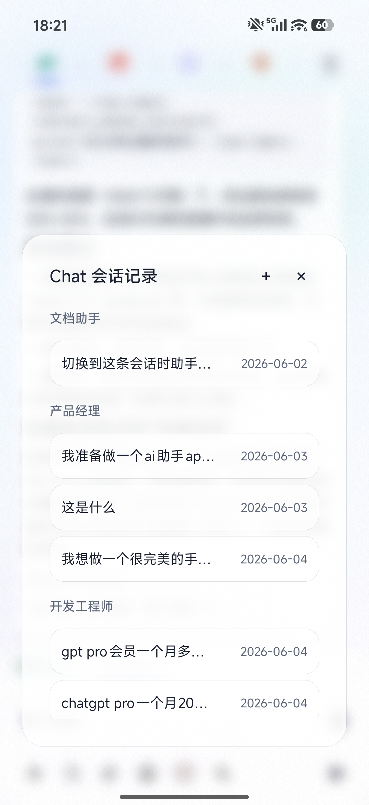
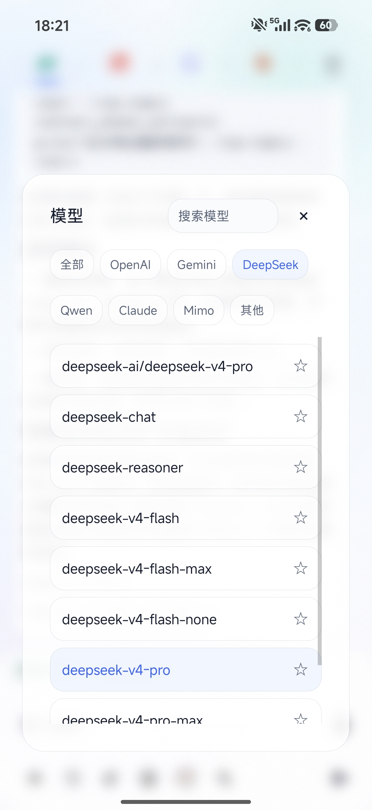
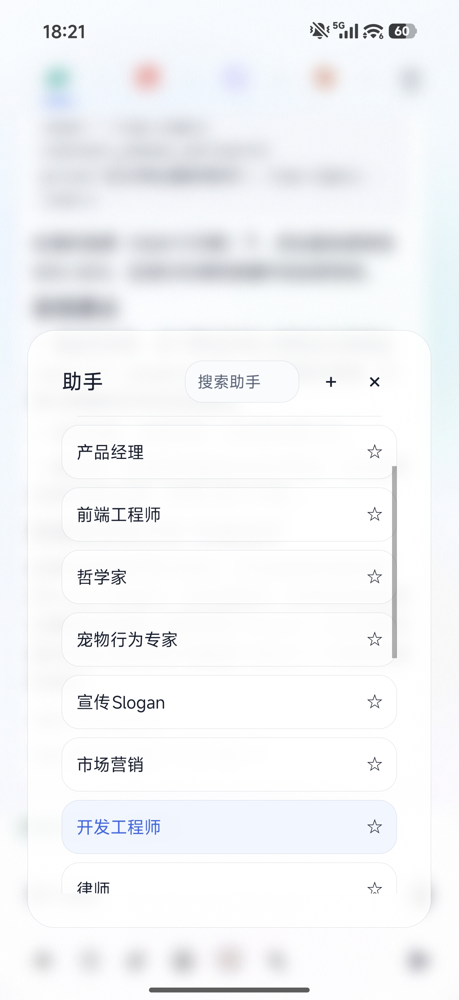
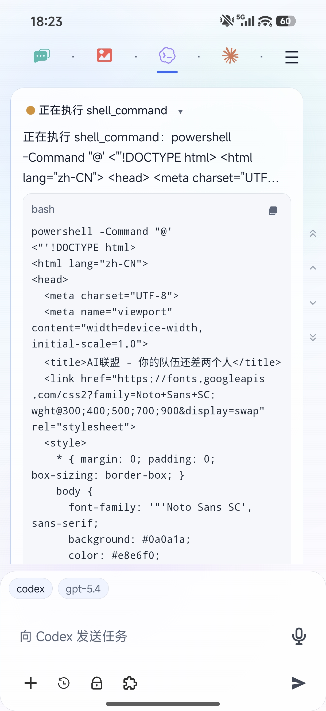
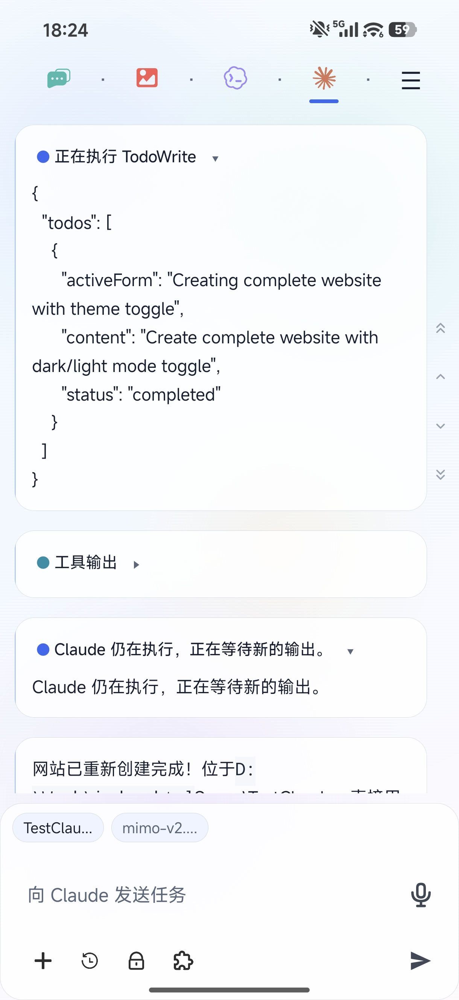
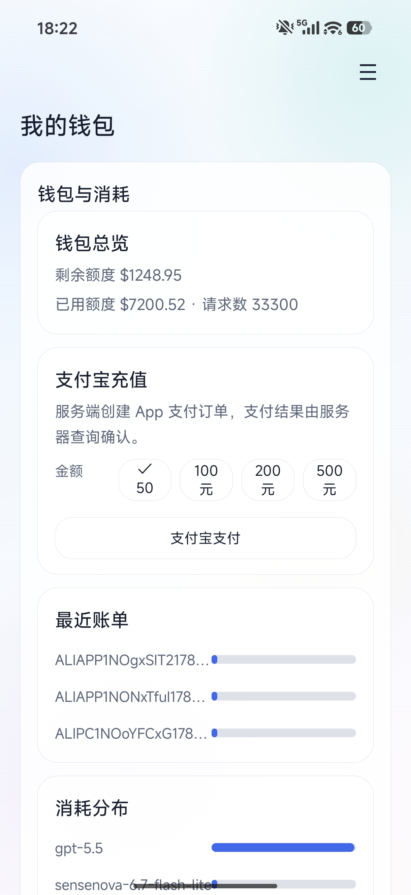
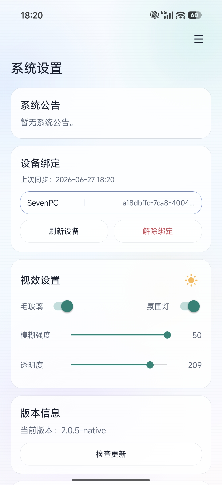
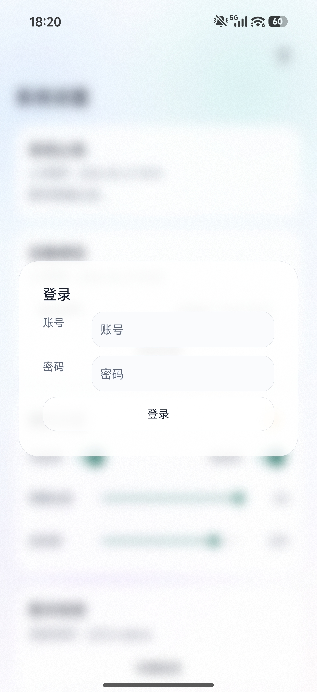

# OneAPI Android

[简体中文](README.md) | **English**

OneAPI Android is the native Android client for [ai.oneapi.center](https://ai.oneapi.center). It brings mobile AI chat, image generation, Codex/Claude desktop coordination, wallet recharge, subscriptions, service status, and compliance flows into one compact workspace. The app is designed for users who need to continue AI work on mobile, monitor quota usage, track desktop execution, and manage multi-model workflows from one account.

## Platform Value

[ai.oneapi.center](https://ai.oneapi.center) provides unified accounts, model routing, quota billing, payment, content safety, and cross-device sync. The Android client makes those platform capabilities available on mobile:

- **Mobile AI workspace**: Chat sessions, assistant switching, model selection, voice input, attachments, and local-first conversation persistence.
- **Image workflows**: Platform-backed image generation and editing for posters, avatars, assets, and creative drafts.
- **Desktop coordination**: Send tasks to Codex or Claude on the PC client, then follow execution logs, tool output, and project status from Android.
- **Account and billing**: Wallet balance, quota usage, recent bills, subscription entry points, and Alipay recharge.
- **Safety and compliance**: Service status, app updates, device binding, user agreement, privacy policy, generative AI service notice, and content safety rules.

## Screenshots

| Chat | Sessions | Models |
| --- | --- | --- |
|  |  |  |

| Assistants | Codex Remote Task | Claude Remote Task |
| --- | --- | --- |
|  |  |  |

| Wallet | Settings | Login |
| --- | --- | --- |
|  |  |  |

## Core Capabilities

### Chat and Image

- Main sections include Chat, Image, Codex, Claude, Settings, Wallet, Service Status, and Subscriptions.
- Chat supports multiple assistants, multiple model families, conversation history, token statistics, attachments, voice input, and local-first caching.
- Image workflows use the platform image APIs with assistant prompts and quality options to support mobile creation.

### Codex / Claude Desktop Coordination

- Android can bind to a desktop device and sync projects, recent tasks, execution state, and tool output through the platform.
- Tasks can be submitted from Android, executed on the desktop client, and monitored from mobile.
- Recent sessions are designed around local cache and incremental sync, while project lists, execution state, and high-priority business requests remain prioritized.

### Account, Quota, and Payment

- The wallet page shows remaining quota, used quota, request count, recent bills, and usage distribution.
- Alipay recharge is created by the server. Android launches payment through the Alipay SDK, and the final result is confirmed by server-side order status.
- Recharge amounts are fixed at 50, 100, 200, and 500 CNY to keep Android, desktop, and web behavior aligned.

### Compliance and Safety

- First login requires accepting the user agreement and privacy policy before entering the app.
- Settings include an About & Compliance dialog for the user agreement, privacy policy, generative AI service notice, and content safety rules.
- New conversations show a safety and privacy reminder, with an option to suppress future reminders.

## Relationship With ai.oneapi.center

The Android app connects to this server by default:

```text
https://ai.oneapi.center
```

The platform owns account authentication, model catalog, API key forwarding, quota billing, subscriptions, service status, payment orders, content safety, and cross-device sync. Android does not replace server-side responsibilities. Account and payment operations must go through the ai.oneapi.center backend APIs.

## Build From Source

### Requirements

- JDK 17
- Android SDK 35
- Gradle 8.10.2 or a compatible Gradle version
- Android Gradle Plugin 8.7.2
- Android 8.0+ device or emulator

### Build

```powershell
cd D:\WorkSpace\NewAPI\OneAPI_Android
gradle.bat --no-daemon assembleRelease
```

Default release output:

```text
app/build/outputs/apk/release/app-arm64-v8a-release.apk
```

The current configuration builds an `arm64-v8a` APK with package name `center.oneapi.mobile`.

## Project Structure

```text
app/src/main/java/center/oneapi/mobile/
  core/                 API client and preferences
  data/                 Room conversation data
  features/             Billing, desktop sync, image, keys, service status
  navigation/           Main app section definitions
  ui/                   Shared UI, composer, conversation list, message rendering
docs/                   Alipay and platform integration docs
images/                 README screenshots
```

## Configuration and Security

- Do not commit real signing keys, production secrets, server credentials, or local environment files.
- The default server is configured in `AppPrefs.DEFAULT_SERVER`.
- Sensitive files such as `server.env`, payment keys, and MinIO credentials should stay in controlled deployment environments.

## License

This project is distributed under the license in the repository `LICENSE` file. Before use, redistribution, or commercial deployment, review the platform service terms, upstream model provider terms, and applicable legal requirements.
